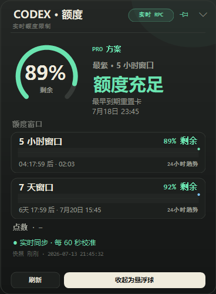
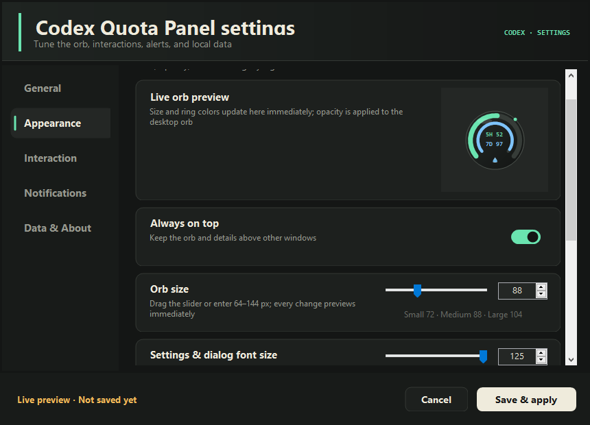
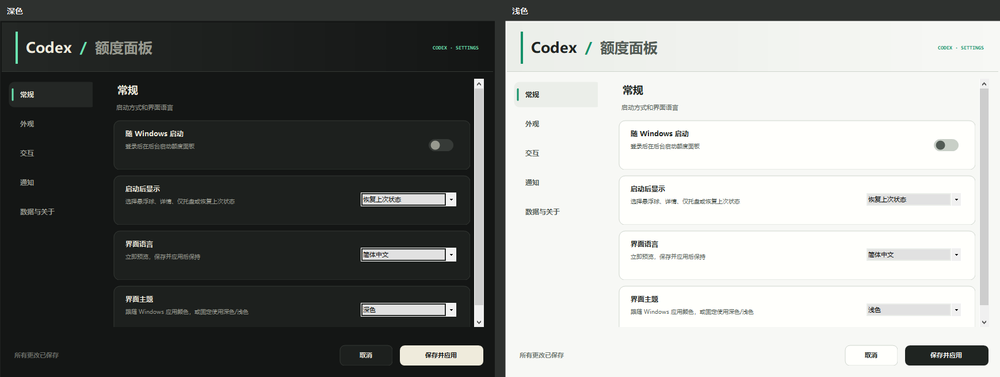
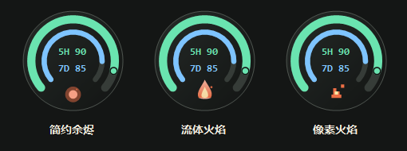
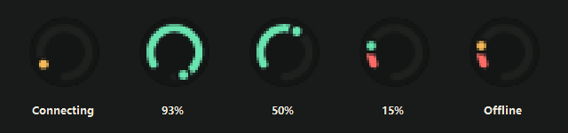

# CodexQuotaPanel

<p align="center">
  <strong>把 Codex 额度变成一眼可见的 Windows 桌面悬浮球</strong><br>
  轻量、本地、可定制，支持 Windows 10 / Windows 11 x64
</p>

<p align="center">
  <a href="https://github.com/yaozhihang2002/CodexQuotaPanel/releases/tag/v0.2.0"></a>
  
  
  <a href="LICENSE"></a>
</p>

<p align="center">
  
</p>

> 当前版本：**v0.2.0 Pre-release**。这是公开测试版，欢迎通过 GitHub 反馈实际使用中的兼容性和界面问题。

## 界面预览

### 自由定制的设置中心

尺寸、字体、透明度、双环颜色、置顶和鼠标穿透均可调节；设置支持实时预览，保存后不会强制关闭窗口。

<p align="center">
  
</p>

### 深色、浅色与跟随系统

<p align="center">
  
</p>

### 三种火焰反馈

火焰会根据近期额度消耗速度改变状态，可选择简约余烬、流体火焰或像素火焰。

<p align="center">
  
</p>

### 托盘图标也能读懂额度

托盘图标外围会跟随额度变化，并区分连接中、正常、紧张和离线状态。

<p align="center">
  
</p>

## 主要功能

- **额度双环**：同时展示五小时与一周额度，可自由选择窗口、角色和颜色。
- **悬浮球交互**：自由拖动、尺寸调节、置顶、透明度和鼠标穿透，点击即可展开详情。
- **流畅过渡**：悬浮球与详情面板采用点状收束和展开动画。
- **消费速度反馈**：三种火焰样式会随近期额度消耗速度变化。
- **个性化界面**：深色、浅色、跟随系统主题，以及简体中文 / English 界面。
- **提醒与趋势**：额度阈值提醒、免打扰、24 小时本地趋势和最早到期重置卡信息。
- **动态托盘图标**：无需展开面板，也能从图标外围快速判断额度和连接状态。
- **易于安装**：安装前选择语言，默认简体中文；支持自定义安装目录和可选桌面快捷方式。
- **可移植设置**：保存悬浮球位置和个性化参数，重启后自动恢复。

## 下载

**[下载 v0.2.0 Windows 安装包](https://github.com/yaozhihang2002/CodexQuotaPanel/releases/download/v0.2.0/CodexQuotaPanel-0.2.0-Setup.exe)** · [查看全部发布文件](https://github.com/yaozhihang2002/CodexQuotaPanel/releases/tag/v0.2.0)

Release 同时提供中文原生 MSI、便携版 ZIP、源码 ZIP 与 SHA-256 校验文件。

> Windows SmartScreen 可能会提示“未知发布者”，这是因为当前测试版尚未购买代码签名证书。请仅从本项目 Releases 页面下载并核对 SHA-256。

## 隐私与数据

程序在本机读取 Codex 客户端产生的额度事件，不读取 `auth.json`，不保存对话正文或 token，也不上传额度数据。

## 从源码构建

```powershell
dotnet build work\CodexQuotaPanel.Tests\CodexQuotaPanel.Tests.csproj -c Release
dotnet run --project work\CodexQuotaPanel.Tests\CodexQuotaPanel.Tests.csproj -c Release --no-build
```

项目结构：

- `work/CodexQuotaPanel`：WinForms 主程序。
- `work/CodexQuotaPanel.Tests`：逻辑检查、布局截图与动画时序检查。
- `work/Installer`：Visual Studio Installer Projects 安装项目。
- `docs/images`：README 界面预览素材。
- `outputs`：本地发布产物，不纳入 Git。

## 联系与反馈

- GitHub 项目：[yaozhihang2002/CodexQuotaPanel](https://github.com/yaozhihang2002/CodexQuotaPanel)
- 问题反馈：[GitHub Issues](https://github.com/yaozhihang2002/CodexQuotaPanel/issues)
- Email：[zhyao@mail.ustc.edu.cn](mailto:zhyao@mail.ustc.edu.cn)

## 开源许可证

本项目采用 [MIT License](LICENSE)，允许个人或商业使用、修改、分发与再授权。

## 二创与贡献

欢迎 Fork、改造、重新设计界面或制作自己的衍生版本，也欢迎通过 Issue 和 Pull Request 分享改进。发布二创版本时，请保留原始版权声明和 MIT 许可证文本，并清楚标注你的修改内容。
