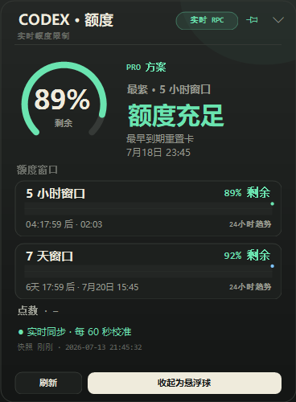
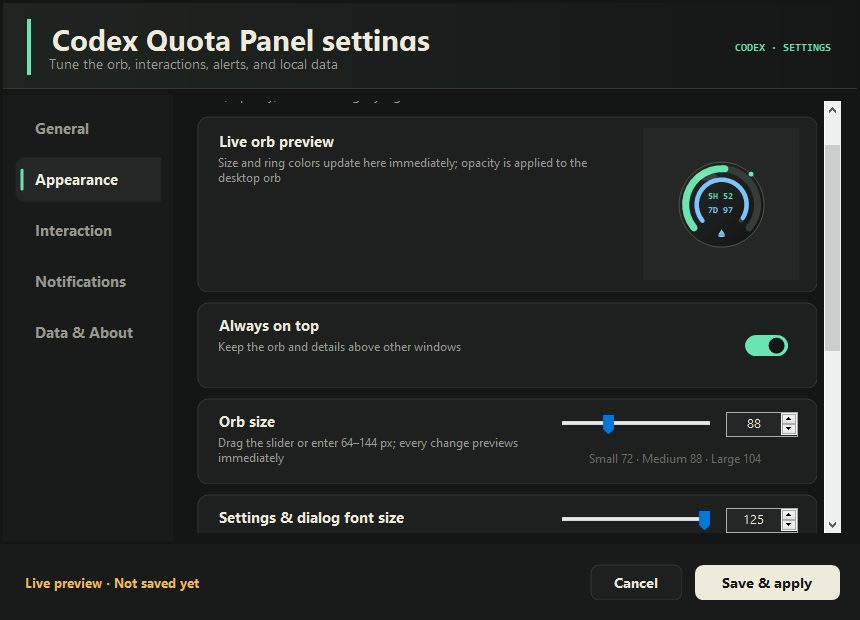
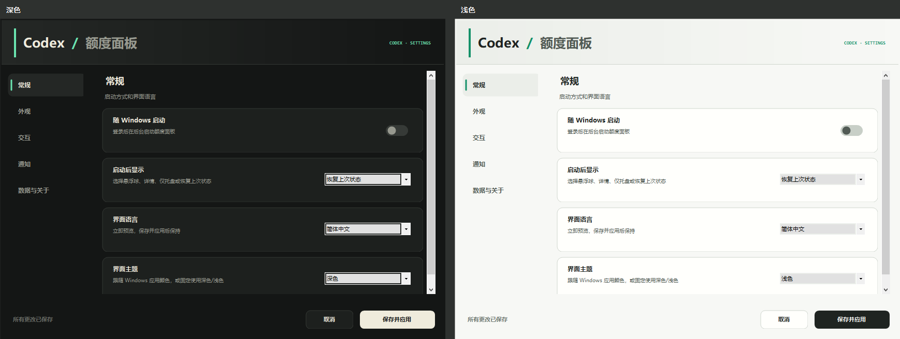
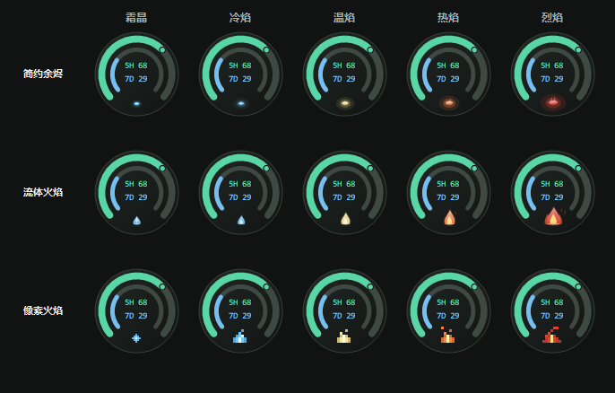
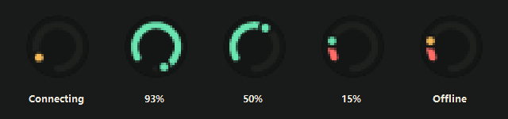

# CodexQuotaPanel

<p align="center">
  <strong>让 Codex 额度安静地待在桌面上，需要时再展开。</strong><br>
  五小时与一周额度双环 · 消耗速度动画 · 本地运行 · 自由定制
</p>

<p align="center">
  <a href="https://github.com/yaozhihang2002/CodexQuotaPanel/releases"></a>
  
  
  <a href="LICENSE"></a>
</p>

<p align="center">
  
</p>

> 当前版本：**v0.5.2 Pre-release**。这是仍在验证兼容性与界面细节的公开测试版，不代表已经达到稳定版标准。遇到问题欢迎通过 [GitHub Issues](https://github.com/yaozhihang2002/CodexQuotaPanel/issues) 反馈。

## vNext 跨平台分支

`codex/vnext-windows-macos` 正在以 Avalonia 和模块化核心重建下一代 **v0.6.0**。它不会覆盖 `work/` 中的 Windows 正式分支；只有功能对照、真实数据源、升级保留和平台验证全部达标后才会接替现有版本。

当前 vNext 已实现：

- 与正式版一致的单环/双环悬浮球、三种消耗反馈、展开详情、24 小时实际趋势与均匀使用参考线。
- 当前重置周期 Token 明细、每日/模型/`Default`/`Fast` 汇总，以及明确标为“API 等价估算、非账单”的美元估算。
- 中英文、深色/浅色/跟随系统、尺寸/字体/透明度/背景/环颜色、置顶、穿透、位置锁定、边缘吸附和提醒设置。
- 设置即时预览、保存后不退出、取消完整回滚、导入/导出、备份恢复、旧版设置迁移、更新检查和重启应用。
- Windows 托盘与 macOS 菜单栏、登录启动、全局找回快捷键，以及平台原生置顶/鼠标穿透适配。
- Token 日志采用有界分批和跨重启增量游标；首次历史索引以及空/损坏游标恢复均由有限工作进程完成并自动退出，主界面不会继承导入内存。实时 App Server 可用时不会先扫描大型 JSONL，回退读取也从文件末尾反向查找最新额度。

vNext 的普通设置、详情和统计界面共用同一套 UI；透明悬浮窗、置顶、穿透、登录启动和全局快捷键由很薄的平台适配层实现。Windows 候选会生成安装包与便携包，macOS 候选会生成 `.app`、ZIP 和 DMG。macOS 正式发布前仍需 Apple Developer ID 签名、公证和真实 Retina 设备验收。

## 一眼了解

- **桌面双环悬浮球**：同时查看五小时与一周额度；窗口、环角色与颜色均可调整，点击后展开完整详情。
- **三种风格、五档状态**：简约余烬、流体火焰和像素火焰都会随近期消耗从霜晶、冷焰逐步变化到浓烈大火。
- **适配日常桌面**：深色、浅色或跟随系统，简体中文 / English，支持多显示器、不同 DPI 与负坐标屏幕。
- **自由但克制**：尺寸、字体、透明度、置顶、鼠标穿透、位置锁定、边缘吸附和提醒方式均可设置。
- **本地与可恢复**：额度趋势和设置留在本机；异常记录仅用于脱敏诊断，下次启动照常恢复上次保存的界面、位置和设置。
- **每日用量与 API 成本估算**：按当前重置周期汇总每日原始 Token，并按模型与 `Default` / `Fast` 分类，使用有日期标记的 OpenAI 公开 API 价格估算美元成本。

## 界面预览

### 外观与交互集中设置

悬浮球尺寸、设置字体、透明度、双环颜色、火焰样式、置顶和鼠标穿透都可以调整。修改会即时预览，“保存并应用”后设置窗口仍会保持打开，方便继续微调。

<p align="center">
  
</p>

### 深色、浅色与跟随系统

<p align="center">
  
</p>

### 三种火焰风格，五档消耗反馈

低活动时显示安静的霜晶或冷焰；消耗加快后逐步升温，特别高时显示更浓烈的火焰。三种风格共享五档状态，也可完全关闭动画。

<p align="center">
  
</p>

### 托盘图标也能读懂额度

托盘图标外围会跟随额度变化，并区分连接中、正常、紧张和离线状态，不展开面板也能快速判断当前情况。

<p align="center">
  
</p>

## v0.5.2 Pre-release 功能

### 额度与显示

- 五小时与一周额度双环，可选择窗口、内外环角色及自定义颜色。
- 点击悬浮球展开详情，支持分窗口、逐分钟原始精度的完整 24 小时趋势；趋势同时显示半透明的均匀使用参考线，鼠标悬停可对照当时的实际额度与均匀规划额度。
- 智能续航估算会计入空闲区间，并融合 90 分钟短期速度、6 小时长期速度与样本置信度；样本不足时保持原有显示，不读取对话内容。
- 本周期每日图按 API 等价美元估算绘制，悬停仍可核对精确输入、缓存输入、缓存写入、输出与推理用量；点击可展开模型和 `Default` / `Fast` 速率明细。日志未写明速率时会在会话内安全回填；Auto-review 按当前官方 Codex 费率表对应的 GPT-5.4 API 价格估算，无法识别或缺少公开费率的模型则保留原始 Token 并标记为“未公开计价”，不会被当作免费或实际账单。
- Token 统计 2.0 同时兼容单次增量与累计记录，识别计数器重置，并对重复快照、归档副本和分叉日志的复制前缀去重；跨重启持久缓存与追加读取减少重复扫描，详情页会显示缓存命中、去重和归因覆盖率。
- 深色、浅色、跟随系统三种主题，以及简体中文 / English 界面。
- 多显示器与 DPI 保护：跨屏拖动时依据目标显示器缩放，处理负坐标与可见区域边界；远程桌面与 150% / 200% 缩放下，悬浮球及设置内预览也会按目标显示器完整绘制。
- 悬浮球位置、大小、字体比例、透明度、置顶和交互偏好会在重启后恢复。

### 动画与交互

- 简约余烬、流体火焰、像素火焰三种样式，每种包含霜晶、冷焰、温焰、热焰和烈焰五档反馈。
- 悬浮球与详情面板采用快速收束 / 展开过渡；拖动交由 Windows 原生窗口移动处理，设置窗口拉伸时只重排当前页面，减少重绘、闪烁与残影。
- 支持鼠标穿透、位置锁定、可选边缘吸附、全局找回快捷键和动态托盘额度图标。

### 恢复、设置与更新

- 非正常退出或电脑重启后不再进入安全模式，始终按上次保存的显示状态、位置和设置启动。
- 托盘右键菜单提供“重启应用”，在界面仍可响应时快速重新加载程序。
- 安装确认页点击“安装”后才会关闭运行中的面板；若安装前处于开启状态，安装结束后自动重新启动。
- 穿透提示支持“不再提醒”，也可在“交互”设置中随时恢复；该偏好支持设置导入与导出。
- 额度警告支持“本额度周期不再提醒”，当前窗口重置后自动恢复提醒。
- 设置采用原子写入并保留备份；升级会读取旧版设置，继续保留悬浮球位置和已有个性化参数。
- 支持导入、导出可移植设置。导出文件不包含悬浮球位置、历史、账户、路径或额度数据。
- 可手动检查 GitHub Release，也可选择启动后检查；最多每 24 小时访问一次，不会自动下载或运行安装包。

## 下载

请只从项目的 **[GitHub Releases](https://github.com/yaozhihang2002/CodexQuotaPanel/releases)** 页面下载。`v0.5.2` 会标记为 **Pre-release**，适用于 **Windows 10 / Windows 11 x64**。

推荐下载 `Setup-Web.exe`：文件本身约 1–3 MB，只有电脑缺少 .NET 9 Desktop Runtime 时才从微软官方下载并校验运行库。无法联网时使用 `Setup-Offline.exe`；它包含完整运行环境。便携包也分为轻量版与完整离线版，所有附件均提供 SHA-256 校验文件。预发布版仍可能存在特定显卡、DPI 组合或系统环境下的兼容性问题。

> Windows SmartScreen 可能提示“未知发布者”，这是因为当前预发布版尚未购买代码签名证书。请确认文件来自本项目 Releases 页面后再运行。

## 隐私与数据

程序在本机读取 Codex 客户端产生的可用额度与结构化 Token 计数事件，不读取 `auth.json` 或对话正文。为减少重复扫描，只在本机保存版本化的聚合计数缓存，不保存对话文本，也不上传额度数据、账号或会话内容。美元金额只是按界面标注日期的公开 API 价格作出的等价估算，不是订阅账单，也不是官方额度百分比换算。额度是否可显示仍取决于当前电脑上 Codex 客户端产生的数据是否可用。

## 从源码构建

### vNext（Windows / macOS）

vNext 使用自包含发布，普通用户不需要预装现代 .NET Desktop Runtime。开发机需要对应的 .NET 10 SDK：

```powershell
dotnet restore CodexQuotaPanel.VNext.slnx
dotnet build CodexQuotaPanel.VNext.slnx -c Release
dotnet run --project tests/CodexQuota.Domain.Tests -c Release --no-build
dotnet run --project tests/CodexQuota.Application.Tests -c Release --no-build
dotnet run --project tests/CodexQuota.Infrastructure.Tests -c Release --no-build
dotnet run --project tests/CodexQuota.UI.Tests -c Release --no-build
```

Windows 本地候选只构建一次应用载荷，并由安装器与便携包复用：

```powershell
installer/Windows/Build-Release.ps1 -Version 0.6.0 -DotNetPath <dotnet.exe>
```

macOS 在 Apple runner 或 Mac 上生成 `.app`、ZIP 和 DMG：

```powershell
installer/macOS/Build-Package.ps1 -Version 0.6.0 -Runtime osx-arm64
```

### 现有 Windows 正式分支

需要 Windows x64 与对应的 .NET SDK：

```powershell
dotnet build work\CodexQuotaPanel.Tests\CodexQuotaPanel.Tests.csproj -c Release
dotnet run --project work\CodexQuotaPanel.Tests\CodexQuotaPanel.Tests.csproj -c Release --no-build
```

在装有 Visual Studio Installer Projects 的开发机上，可使用一次构建、多产物复用的本地发布脚本：

```powershell
work\Installer\Build-Release.ps1 -Version 0.5.2
```

脚本默认只生成并验证本地产物；确认版本无误并已经创建对应 Git 标签后，可显式添加 `-PublishToGitHub -PublishConfirmation "PUBLISH v0.5.2"`，直接复用同一批产物上传，不会重新构建。脚本分别生成自包含载荷与体积很小的 framework-dependent 主机，随后由中英文安装器和便携包共同复用，不会为每个附件重复构建应用。

项目结构：

- `work/CodexQuotaPanel`：WinForms 主程序。
- `work/CodexQuotaPanel.Tests`：逻辑检查、布局截图与动画时序检查。
- `work/Installer`：Windows 安装项目。
- `docs/images`：README 界面预览素材。
- `outputs`：本地发布产物，不纳入 Git。

## 联系与反馈

- GitHub 项目：[yaozhihang2002/CodexQuotaPanel](https://github.com/yaozhihang2002/CodexQuotaPanel)
- 问题反馈：[GitHub Issues](https://github.com/yaozhihang2002/CodexQuotaPanel/issues)
- Email：[zhyao@mail.ustc.edu.cn](mailto:zhyao@mail.ustc.edu.cn)

## 开源许可证与二创

本项目采用 [MIT License](LICENSE)，允许个人或商业使用、修改、分发与再授权。欢迎 Fork、重新设计界面或制作衍生版本；发布二创时请保留原始版权声明和 MIT 许可证文本，并清楚标注修改内容。
